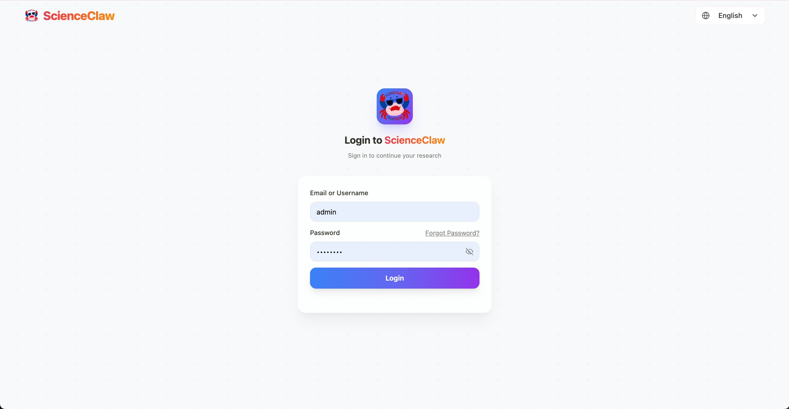

<div align="center">

<h1>&nbsp;ScienceClaw</h1>

**[English](README.md)** | **[中文](README_zh.md)**

</div>

ScienceClaw is a personal research assistant built with [LangChain DeepAgents](https://github.com/langchain-ai/deepagents) and [AIO Sandbox](https://github.com/agent-infra/sandbox) infrastructure, adopting a completely new architecture beyond OpenClaw. It offers stronger security, better transparency, and a more user-friendly experience.

<div align="center">

*1,900+ built-in scientific tools · Multi-format content generation · Fully local & privacy-first*

[](./Tools) [](./Skills) [](./ScienceClaw/frontend) [](./ScienceClaw/backend) [](./ScienceClaw/task-service) [](./ScienceClaw/sandbox) [](LICENSE)

---

<video src="https://github.com/user-attachments/assets/2680110c-e9f6-4007-9c56-b923c35f9992" controls width="800" autoplay muted loop></video>

[Why ScienceClaw](#why-scienceclaw) · [Architecture](#architecture) · [News](#news) · [Quick Start](#quick-start) · [Demo](#demo) · [Free API Credits](#free-api-credits) · [Tools & Skills](#tools-skills) · [Features](#practical-features) · [Project Structure](#project-structure) · [Commands](#commands) · [Community](#community) · [Acknowledgements](#acknowledgements)

</div>

---

<a id="why-scienceclaw"></a>

## ✨ Why ScienceClaw

<table>
<tr>
<td width="37%" valign="top">

### 🔒 Security First

ScienceClaw runs entirely inside **Docker containers**. The agent cannot access your host system, personal files, or environment variables. All code execution happens in an **isolated sandbox**, and generated data stays in a local `./workspace` directory — nothing is uploaded to external servers. Deploy with confidence on your own machine.

</td>
<td width="32%" valign="top">

### 👁️ Full Transparency

Every step of the agent's workflow is **visible and traceable** — from web search and data crawling, to reasoning and tool invocation, to final report generation. You always know where results come from, what actions were taken, and how conclusions were reached. Inspect any step at any time.

</td>
<td width="31%" valign="top">

### 🚀 Ready Out of the Box

No tedious configuration needed. ScienceClaw ships with curated tools and skill packages — launch the entire environment with **a single command**. Whether you're a researcher, developer, or student, you can get started immediately. Focus on real tasks, not setup.

</td>
</tr>
</table>

---

<a id="architecture"></a>

## 🏗️ Architecture

<div align="center">

</div>

---

<a id="news"></a>

## 📢 News

- **[2026-03-13]** ScienceClaw v0.0.1 is officially released! Visit our website: [scienceclaw.taichuai.cn](https://scienceclaw.taichuai.cn/)

---

<a id="quick-start"></a>

## 📦 Quick Start

###  Windows Users — Desktop App (One-Click Install)

No Docker required, no command-line needed. Download the desktop installer and get started instantly.

**1. Download the installer**

👉 [ScienceClaw Desktop v0.0.4 (.tar.gz)](https://gitee.com/zidongtaichu_beijing/scienceclaw/releases/download/v0.0.4/ScienceClaw-Desktop-Setup-0.0.4.tar.gz)

**2. Extract and install**

After downloading, extract the archive and run the installer. Follow the setup wizard to complete installation.

**3. Launch**

Once installed, double-click the desktop shortcut to start ScienceClaw — ready to use out of the box.

---

###  macOS / Linux Users — Docker Deployment

> 📖 For a detailed step-by-step deployment guide, see [**Deployment Guide (中文)**](docs/deployment-guide-zh.md).

#### Prerequisites

- [Docker](https://docs.docker.com/get-docker/) & [Docker Compose](https://docs.docker.com/compose/install/) (Docker Desktop includes Compose)
- Recommended system RAM ≥ 8 GB

#### Install & Launch

**1. Get the code**

- **Fresh install:**

```bash
git clone https://github.com/AgentTeam-TaichuAI/ScienceClaw.git
cd ScienceClaw
```

- **Upgrade an existing installation:**

```bash
cd ScienceClaw
git pull
```

**2. Launch — pull pre-built images**

```bash
docker compose -f docker-compose-release.yml up -d --pull always
```

> Pulls pre-built images directly — no local compilation needed. Ready in a few minutes.


**3. Open in browser**

```
http://localhost:5173
```

**4. Login**

<table>
<tr>
<td width="60%">

</td>
<td width="40%" valign="middle" style="padding-left: 24px;">
<br/><br/>
<p><strong>Default admin credentials:</strong></p>
<table>
<tr><td><strong>Field</strong></td><td><strong>Value</strong></td></tr>
<tr><td>Username</td><td><code>admin</code></td></tr>
<tr><td>Password</td><td><code>admin123</code></td></tr>
</table>
<blockquote>⚠️ Please change the default password after your first login.</blockquote>
</td>
</tr>
</table>

---

### 🛠️ Developers — Build from Source

```bash
docker compose up -d --build
```

> Builds all images from source code. Ideal for developers who need to modify the code. The first build downloads dependencies and may take longer.

---

<a id="demo"></a>

## 🎬 Demo

<video src="https://github.com/user-attachments/assets/9cf07107-4820-4a0e-af3d-e95a17417156" controls width="800" autoplay muted loop></video>

---

<a id="free-api-credits"></a>

## 🎁 Free LLM API Credits for Early Users

To lower the barrier for new users, a limited batch of LLM API resources:

| Offer | Details |
|---|---|
| SCNet (National Supercomputing Internet) | **10M free tokens** ([Claim here](https://www.scnet.cn/ui/mall/en)) |
| Zidong Taichu Cloud | **10M free tokens** ([Claim here](https://gateway.taichuai.cn/modelhub/apply)) |

> Limited availability — first come, first served. We will continue to secure more compute resources for the community.

---

<a id="tools-skills"></a>

## 🔧 Tools & Skills System

### 🧪 1,900+ Built-in Scientific Tools

ScienceClaw integrates **ToolUniverse**, a unified ecosystem of 1,900+ scientific tools spanning **multiple disciplines**:

| Domain | Capabilities |
|---|---|
| 💊 **Drug Discovery & Biomedicine** | Target identification (OpenTargets), ADMET prediction, drug safety (FAERS), protein analysis (UniProt, PDB, AlphaFold), genomics (GWAS, GTEx), clinical trials |
| 🔭 **Astronomy & Space Science** | SIMBAD astronomical objects, SDSS sky survey, NASA exoplanet archive, JPL Horizons ephemeris, NASA DONKI solar events, small body database |
| 🌍 **Earth & Environmental Science** | USGS earthquakes & hydrology, ERDDAP ocean/climate data, SoilGrids, air quality (WAQI), OpenMeteo weather/climate, marine regions |
| ⚗️ **Chemistry & Materials** | COD crystal structures, molecular property prediction, SMILES-based analysis, compound similarity, chemical computation |
| 🌱 **Biodiversity & Ecology** | GBIF species records, OBIS marine biodiversity, POWO plant taxonomy, WoRMS marine species, eBird taxonomy, paleobiology database |
| 📊 **Social Science & Statistics** | World Bank indicators, Eurostat, US Census population data, Wikidata knowledge graph, DBpedia |
| 📚 **Academic Literature** | Multi-source search (PubMed, arXiv, OpenAlex, Semantic Scholar, DBLP, INSPIRE-HEP, Crossref, DOAJ, CORE) |
| 🤖 **Data Science & Computing** | HuggingFace models/datasets, OpenML, GitHub repositories, scientific computing software, image processing |

### 🛠️ Four-Layer Tool Architecture

| Layer | Description | Examples |
|---|---|---|
| 🔧 **Built-in Tools** | Core search & crawl capabilities | `web_search`, `web_crawl` |
| 🧪 **ToolUniverse** | 1,900+ scientific tools, ready to use | UniProt, OpenTargets, FAERS, PDB, ADMET, etc. |
| 📦 **Sandbox Tools** | File operations & code execution | `read_file`, `write_file`, `execute`, `shell` |
| 🛠️ **Custom @tool** | User-defined Python functions, hot-loaded from `Tools/` | Your own tools |

### 🎨 Custom Tools

ScienceClaw makes it easy to extend with your own tools:

- **Natural language creation** — Simply describe what you want in chat, and the agent will create, test, and save a new tool for you automatically.
- **Manual mounting** — Drop any Python file with `@tool` decorated functions into the `Tools/` directory; they are auto-detected and hot-loaded without restart.

### 🧠 Skill System

Skills are **structured instruction documents (SKILL.md)** that guide the Agent through complex, multi-step workflows. Unlike tools (executable code), skills act as the Agent's "playbook" — defining strategies, rules, and best practices.

#### Built-in Skills

| Skill | Purpose |
|---|---|
| 📄 **pdf** | Read, create, merge, split, OCR, and generate professional PDF research reports |
| 📝 **docx** | Create and edit Word documents with cover pages, TOC, tables, and charts |
| 📊 **pptx** | Generate and edit PowerPoint slide decks |
| 📈 **xlsx** | Create and manipulate Excel spreadsheets, CSV/TSV data processing |
| 🛠️ **tool-creator** | Create & upgrade custom @tool functions (write → test → save) |
| 📝 **skill-creator** | Create & refine skills with draft → test → review → iterate |
| 🔍 **find-skills** | Search, discover & install community skills from the open ecosystem |
| 🧪 **tooluniverse** | Unified access to 1,900+ scientific tools |

#### Multi-Format Report Generation

ScienceClaw can produce professional research deliverables in **4 document formats**:

| Format | Features |
|---|---|
| **PDF** | Cover page, table of contents, charts (bar/pie/line), in-text citations, references, academic styling |
| **DOCX** | Cover page, TOC, tables, images, blue-superscript citations, Word-native formatting |
| **PPTX** | Slide decks with titles, bullet points, images, speaker notes |
| **XLSX** | Data tables, charts, multi-sheet workbooks, CSV/TSV export |

#### Custom Skills

- **Natural language creation** — Describe your workflow in chat, and the agent will draft, test, and save a new skill for you.
- **Manual installation** — Place a folder with a `SKILL.md` file into the `Skills/` directory. The agent automatically matches and loads relevant skills based on user intent.
- **Community ecosystem** — Discover and install skills from the open community with the built-in `find-skills` capability.

---

<a id="practical-features"></a>

## 💡 Practical Features

| Feature | Description |
|---|---|
| 📨 **One-Click Feishu (Lark) Integration** | Configure Feishu webhook notifications in settings — receive task results, alerts, and reports directly in your Feishu group chat. |
| ⏰ **Scheduled Tasks** | Set up recurring or one-time tasks with cron-like scheduling. The agent runs automatically at the specified time and delivers results via Feishu or in-app notifications. |
| 📁 **File Management System** | Built-in file panel for browsing, previewing, and downloading all workspace files generated during agent sessions — no need to dig through directories. |
| 📊 **Resource Monitoring** | Real-time system resource dashboard showing LLM resource consumption and service health — stay informed about your deployment status at a glance. |

---

<a id="project-structure"></a>

## 📂 Project Structure

```
ScienceClaw/
├── docker-compose.yml              # 10-service orchestration
├── docker-compose-release.yml      # Pre-built image orchestration (for end users)
├── docker-compose-china.yml        # China mirror acceleration
├── images/                         # Static assets (logo, screenshots)
├── videos/                         # Demo videos
├── Tools/                          # Custom tools (hot-reload)
├── Skills/                         # User & community skill packages
├── workspace/                      # 🔒 Local workspace (data never leaves your machine)
└── ScienceClaw/
    ├── backend/                    # FastAPI backend
    │   ├── deepagent/              # Core AI agent engine (LangGraph)
    │   ├── builtin_skills/         # 9 built-in skills (pdf, docx, pptx, xlsx, tooluniverse, ...)
    │   ├── route/                  # REST API routes
    │   ├── im/                     # IM integrations (Feishu / Lark)
    │   ├── mongodb/                # Database access layer
    │   ├── user/                   # User management
    │   ├── scripts/                # Utility scripts (Feishu setup, etc.)
    │   └── translations/           # i18n language packs
    ├── frontend/                   # Vue 3 + Tailwind frontend
    ├── sandbox/                    # Isolated code execution environment
    ├── task-service/               # Scheduled task service (cron jobs)
    └── websearch/                  # Search & crawl microservice
```

---

<a id="commands"></a>

## 🧑‍💻 Useful Commands

```bash
# First launch (recommended for most users) — pull pre-built images, no local compilation
docker compose -f docker-compose-release.yaml up -d

# First launch (for developers) — build from source and start all services
docker compose up -d --build

# First launch (for developers in China) — build with Chinese mirror sources for faster downloads
docker compose -f docker-compose-china.yml up -d --build

# Daily launch — fast startup, no rebuild needed
docker compose up -d

# Check service status
docker compose ps

# View logs (-f to follow in real time)
docker compose logs -f backend     # Backend logs
docker compose logs -f frontend    # Frontend logs
docker compose logs -f sandbox     # Sandbox logs

# Restart a single service
docker compose restart backend

# Stop all services
docker compose down

# Stop a single service
docker compose stop backend
```

---

## 🗑️ Uninstall

ScienceClaw is built entirely on Docker, so uninstalling it is clean and simple — it has **no side effects on your host system**.

```bash
# Stop and remove all containers
docker compose down

# (Optional) Remove downloaded images to free up disk space
docker compose down --rmi all --volumes
```

Then simply delete the project folder:

```bash
rm -rf /path/to/ScienceClaw
```

That's it. No residual files, no registry entries, no system-level changes.

---

## 🏛️ Built By

**Zhongke Zidong Taichu (Beijing) Technology Co., Ltd.**

---

<a id="community"></a>

## 🤝 Community

We welcome contributions, feedback, and discussions! Join our community:

- Submit issues and feature requests via [GitHub Issues](https://github.com/AgentTeam-TaichuAI/ScienceClaw/issues)
- Share your custom tools and skills with the community

---

## 📄 License

[MIT License](LICENSE)

---

<a id="acknowledgements"></a>

## 🙏 Acknowledgements

ScienceClaw is built on the shoulders of excellent open-source projects. We would like to express our sincere gratitude to:

- **[LangChain DeepAgents](https://github.com/langchain-ai/deepagents)** — The batteries-included agent harness built on LangChain and LangGraph. ScienceClaw's core agent engine is powered by the DeepAgents architecture, which provides planning, filesystem access, sub-agent delegation, and smart context management out of the box.

- **[AIO Sandbox](https://github.com/agent-infra/sandbox)** — The all-in-one agent sandbox environment that combines Browser, Shell, File, and MCP operations in a single Docker container. ScienceClaw relies on AIO Sandbox to provide secure, isolated code execution with a unified file system.

- **[ToolUniverse](https://github.com/ZitnikLab/ToolUniverse)** — A unified ecosystem of 1,900+ scientific tools developed by the Zitnik Lab at Harvard. ToolUniverse powers ScienceClaw's multi-disciplinary research capabilities across drug discovery, genomics, astronomy, earth science, and more.

- **[SearXNG](https://github.com/searxng/searxng)** — A privacy-respecting, hackable metasearch engine. ScienceClaw uses SearXNG as the backbone of its `web_search` tool, aggregating results from multiple search engines without tracking.

- **[Crawl4AI](https://github.com/unclecode/crawl4ai)** — An open-source, LLM-friendly web crawler. ScienceClaw's `web_crawl` tool is powered by Crawl4AI, enabling intelligent content extraction from web pages for research and analysis.

---

## ⭐ Star History

<div align="center">

[](https://star-history.com/#AgentTeam-TaichuAI/ScienceClaw&Date)

</div>

## Contributors

- [Zhiyuan Li](https://github.com/Zhiyuan-Li-John)
- [Guangchuan Guo](https://github.com/meizhuhanxiang)
- [Shaoling Lin](https://github.com/SharryLin)
- [Songsong Lei](https://github.com/slei)
- [Zhidong Zhang](https://github.com/mumudd)

**Technical Support:** NLP Group, Institute of Automation, Chinese Academy of Sciences

