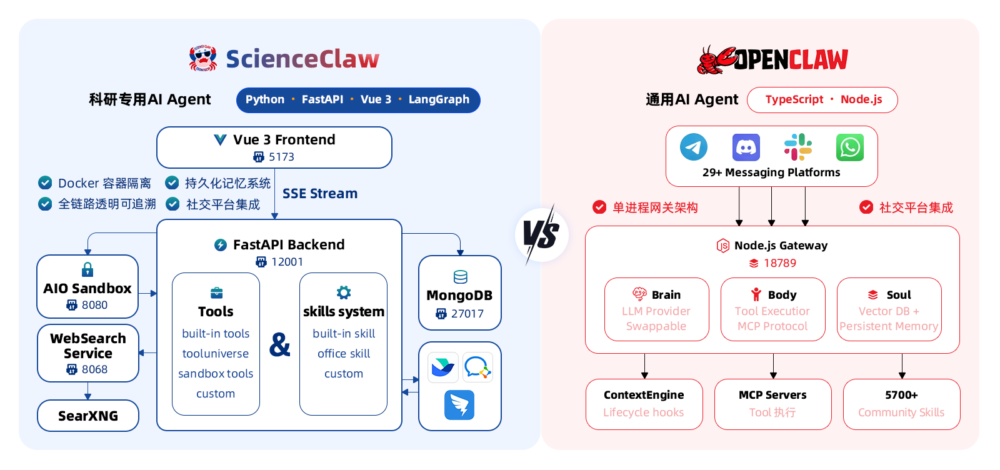

<div align="center">

<h1>&nbsp;ScienceClaw</h1>

**[English](README.md)** | **[中文](README_zh.md)**

</div>

ScienceClaw 是一款基于 [LangChain DeepAgents](https://github.com/langchain-ai/deepagents) 架构与 [AIO Sandbox](https://github.com/agent-infra/sandbox) 基础设施构建的个人科研助手，摒弃了 OpenClaw 的旧有架构，从底层全面重新设计，在安全性、透明度和易用性上实现质的飞跃。

<div align="center">

*1,900+ 内置科研工具 · 多格式内容生成 · 完全本地化 · 隐私优先*

[](./Tools) [](./Skills) [](./ScienceClaw/frontend) [](./ScienceClaw/backend) [](./ScienceClaw/task-service) [](./ScienceClaw/sandbox) [](LICENSE)

---

<video src="https://github.com/user-attachments/assets/2680110c-e9f6-4007-9c56-b923c35f9992" controls width="800" autoplay muted loop></video>

[产品优势](#why-scienceclaw) · [架构](#architecture) · [动态](#news) · [快速开始](#quick-start) · [演示](#demo) · [免费额度](#free-api-credits) · [工具与技能](#tools-skills) · [实用功能](#practical-features) · [项目结构](#project-structure) · [常用命令](#commands) · [社区](#community) · [致谢](#acknowledgements)

</div>

---

<a id="why-scienceclaw"></a>

## ✨ 产品优势

<table>
<tr>
<td width="37%" valign="top">

### 🔒 安全至上

ScienceClaw 完全运行在 **Docker 容器**内。Agent 无法访问您的宿主系统、个人文件或环境变量。所有代码均在**隔离沙箱**中执行，生成的数据仅保存在本地 `./workspace` 目录——不会上传到任何外部服务器。可以放心在您自己的设备上部署使用。

</td>
<td width="32%" valign="top">

### 👁️ 全链路透明

Agent 工作流的每一步都**清晰可见、全程可追溯**——从网页搜索、数据爬取，到推理决策、工具调用，再到最终报告生成。您始终清楚结果从何而来、经过了哪些操作、如何得出结论。方便用户随时检查任何步骤。

</td>
<td width="31%" valign="top">

### 🚀 开箱即用

无需繁琐配置。ScienceClaw 内置精选的工具集与技能包——**一条命令**即可启动完整环境。无论您是研究人员、开发者还是学生，都能立即上手，专注于实际任务解决而非环境搭建与调试。

</td>
</tr>
</table>

---

<a id="architecture"></a>

## 🏗️ 架构

<div align="center">

</div>

---

<a id="news"></a>

## 📢 动态

- **[2026-03-13]** ScienceClaw v0.0.1 正式发布！欢迎访问我们的官网：[scienceclaw.taichuai.cn](https://scienceclaw.taichuai.cn/)

---

<a id="quick-start"></a>

## 📦 快速开始

###  Windows 普通用户 —— 桌面端一键安装

无需安装 Docker，无需命令行操作。下载桌面端安装包，双击即可使用。

**1. 下载安装包**

👉 [ScienceClaw Desktop v0.0.4（.tar.gz）](https://gitee.com/zidongtaichu_beijing/scienceclaw/releases/download/v0.0.4/ScienceClaw-Desktop-Setup-0.0.4.tar.gz)

**2. 解压并安装**

下载完成后解压压缩包，运行安装程序，按照向导提示完成安装。

**3. 启动使用**

安装完成后，双击桌面快捷方式即可启动 ScienceClaw，开箱即用。

---

###  macOS / Linux 普通用户 —— Docker 部署

> 📖 详细的分步部署教程请参考 [**本地部署指南**](docs/deployment-guide-zh.md)。

#### 前置要求

- [Docker](https://docs.docker.com/get-docker/) & [Docker Compose](https://docs.docker.com/compose/install/)（Docker Desktop 已包含 Compose）
- 建议系统内存 ≥ 8 GB

#### 安装与启动

**1. 获取代码**

- **全新安装：**

```bash
git clone https://github.com/AgentTeam-TaichuAI/ScienceClaw.git
cd ScienceClaw
```

- **升级已有安装：**

```bash
cd ScienceClaw
git pull
```

**2. 启动 —— 拉取预构建镜像**

```bash
docker compose -f docker-compose-release.yml up -d --pull always
```

> 直接拉取预构建镜像，无需本地编译，几分钟即可完成。

**3. 打开浏览器访问**

```
http://localhost:5173
```

**4. 登录**

<table>
<tr>
<td width="60%">

</td>
<td width="40%" valign="middle" style="padding-left: 24px;">
<br/><br/>
<p><strong>默认管理员账号：</strong></p>
<table>
<tr><td><strong>字段</strong></td><td><strong>值</strong></td></tr>
<tr><td>用户名</td><td><code>admin</code></td></tr>
<tr><td>密码</td><td><code>admin123</code></td></tr>
</table>
<blockquote>⚠️ 首次登录后请及时修改默认密码。</blockquote>
</td>
</tr>
</table>

---

### 🛠️ 开发者 —— 从源码构建

```bash
docker compose up -d --build
```

> 从源码构建所有镜像，适合需要修改代码的开发者。首次构建需下载依赖，可能需要较长时间。

---

<a id="demo"></a>

## 🎬 演示

<video src="https://github.com/user-attachments/assets/9cf07107-4820-4a0e-af3d-e95a17417156" controls width="800" autoplay muted loop></video>

---

<a id="free-api-credits"></a>

## 🎁 早期用户免费 LLM API 额度

为降低新用户的使用门槛，一批限量 LLM API 资源：

| 优惠内容 | 详情 |
|---|---|
| 国家超算互联网平台 | **1000 万免费 Token**（[领取链接](https://www.scnet.cn/ui/mall/en)） |
| 紫东太初云 | **1000 万免费 Token**（[领取链接](https://gateway.taichuai.cn/modelhub/apply)） |

> 限量供应，先到先得。我们将持续为社区争取更多算力资源。

---

<a id="tools-skills"></a>

## 🔧 工具与技能体系

### 🧪 1,900+ 内置科研工具

ScienceClaw 集成了 **ToolUniverse**，这是一个涵盖 1,900+ 科研工具的统一生态系统，覆盖**多个学科领域**：

| 领域 | 能力 |
|---|---|
| 💊 **药物发现与生物医学** | 靶点识别（OpenTargets）、ADMET 预测、药物安全（FAERS）、蛋白质分析（UniProt、PDB、AlphaFold）、基因组学（GWAS、GTEx）、临床试验 |
| 🔭 **天文学与空间科学** | SIMBAD 天体数据库、SDSS 巡天数据、NASA 系外行星档案、JPL Horizons 星历表、NASA DONKI 太阳活动事件、小天体数据库 |
| 🌍 **地球与环境科学** | USGS 地震与水文、ERDDAP 海洋/气候数据、SoilGrids 土壤数据、空气质量（WAQI）、OpenMeteo 天气/气候、海洋区域 |
| ⚗️ **化学与材料科学** | COD 晶体结构、分子性质预测、基于 SMILES 的分析、化合物相似性、化学计算 |
| 🌱 **生物多样性与生态学** | GBIF 物种记录、OBIS 海洋生物多样性、POWO 植物分类、WoRMS 海洋物种、eBird 鸟类分类、古生物数据库 |
| 📊 **社会科学与统计** | 世界银行指标、Eurostat 欧盟统计、美国人口普查数据、Wikidata 知识图谱、DBpedia |
| 📚 **学术文献** | 多源检索（PubMed、arXiv、OpenAlex、Semantic Scholar、DBLP、INSPIRE-HEP、Crossref、DOAJ、CORE） |
| 🤖 **数据科学与计算** | HuggingFace 模型/数据集、OpenML、GitHub 仓库、科学计算软件、图像处理 |


### 🛠️ 四层工具架构

| 层级 | 说明 | 示例 |
|---|---|---|
| 🔧 **内置工具** | 核心搜索与爬取能力 | `web_search`、`web_crawl` |
| 🧪 **ToolUniverse** | 1,900+ 科研工具，开箱即用 | UniProt、OpenTargets、FAERS、PDB、ADMET 等 |
| 📦 **沙箱工具** | 文件操作与代码执行 | `read_file`、`write_file`、`execute`、`shell` |
| 🛠️ **自定义 @tool** | 用户自定义 Python 函数，放入 `Tools/` 目录自动热加载 | 您自己的工具 |

### 🎨 自定义工具

ScienceClaw 支持便捷的工具扩展：

- **自然语言创建** — 在对话中描述您的需求，Agent 会自动创建、测试并保存新工具。
- **手动挂载** — 将包含 `@tool` 装饰器的 Python 文件放入 `Tools/` 目录，系统自动检测并热加载，无需重启。

### 🧠 技能体系

技能是**结构化的指令文档（SKILL.md）**，用于引导 Agent 完成复杂的多步骤工作流。与工具（可执行代码）不同，技能充当 Agent 的"操作手册"——定义策略、规则和最佳实践。

#### 内置技能

| 技能 | 用途 |
|---|---|
| 📄 **pdf** | 读取、创建、合并、拆分、OCR 以及生成专业 PDF 科研报告 |
| 📝 **docx** | 创建和编辑 Word 文档，支持封面、目录、表格和图表 |
| 📊 **pptx** | 生成和编辑 PowerPoint 演示文稿 |
| 📈 **xlsx** | 创建和处理 Excel 电子表格，CSV/TSV 数据处理 |
| 🛠️ **tool-creator** | 创建和升级自定义 @tool 工具（编写 → 测试 → 保存） |
| 📝 **skill-creator** | 创建和优化技能，支持草稿 → 测试 → 评审 → 迭代 |
| 🔍 **find-skills** | 从开源生态搜索、发现和安装社区技能 |
| 🧪 **tooluniverse** | 统一访问 1,900+ 科研工具 |

#### 多格式报告生成

ScienceClaw 可生成 **4 种文档格式**的专业科研成果：

| 格式 | 特性 |
|---|---|
| **PDF** | 封面、目录、图表（柱状图/饼图/折线图）、文内引用、参考文献、学术排版 |
| **DOCX** | 封面、目录、表格、图片、蓝色上标引用、Word 原生排版 |
| **PPTX** | 幻灯片标题、要点列表、图片、演讲者备注 |
| **XLSX** | 数据表格、图表、多工作表、CSV/TSV 导出 |

#### 自定义技能

- **自然语言创建** — 在对话中描述您的工作流，Agent 会自动起草、测试并保存新技能。
- **手动安装** — 将包含 `SKILL.md` 文件的文件夹放入 `Skills/` 目录，Agent 会根据用户意图自动匹配并加载相关技能。
- **社区生态** — 通过内置的 `find-skills` 功能，从开源社区发现和安装技能。


---

<a id="practical-features"></a>

## 💡 实用功能

| 功能 | 说明 |
|---|---|
| 📨 **一键飞书配置** | 在设置中配置飞书 Webhook 通知——任务结果、告警和报告直接推送到飞书群聊，随时掌握最新动态。 |
| ⏰ **定时任务** | 支持 cron 风格的定时或一次性任务调度。Agent 在指定时间自动执行任务，并通过飞书或站内通知推送结果。 |
| 📁 **文件管理系统** | 内置文件面板，可浏览、预览和下载 Agent 会话中生成的所有工作区文件——无需手动翻阅目录。 |
| 📊 **资源监测系统** | 实时系统资源仪表盘，展示大模型资源消耗和服务健康状态——一目了然地掌握部署运行情况。 |

---

<a id="project-structure"></a>

## 📂 项目结构

```
ScienceClaw/
├── docker-compose.yml              # 10 个服务编排
├── docker-compose-release.yml      # 预构建镜像编排（适合普通用户）
├── docker-compose-china.yml        # 国内镜像加速
├── images/                         # 静态资源（logo、截图）
├── videos/                         # 演示视频
├── Tools/                          # 自定义工具（热加载）
├── Skills/                         # 用户与社区技能包
├── workspace/                      # 🔒 本地工作目录（数据不离开您的设备）
└── ScienceClaw/
    ├── backend/                    # FastAPI 后端
    │   ├── deepagent/              # AI Agent 核心引擎（LangGraph）
    │   ├── builtin_skills/         # 9 个内置技能（pdf、docx、pptx、xlsx、tooluniverse……）
    │   ├── route/                  # REST API 路由
    │   ├── im/                     # IM 集成（飞书 / Lark）
    │   ├── mongodb/                # 数据库访问层
    │   ├── user/                   # 用户管理
    │   ├── scripts/                # 工具脚本（飞书配置等）
    │   └── translations/           # 国际化语言包
    ├── frontend/                   # Vue 3 + Tailwind 前端
    ├── sandbox/                    # 隔离代码执行环境
    ├── task-service/               # 定时任务服务（cron 调度）
    └── websearch/                  # 搜索与爬取微服务
```

---

<a id="commands"></a>

## 🧑‍💻 常用命令

```bash
# 首次启动（普通用户推荐）—— 直接拉取预构建镜像，无需本地编译
docker compose -f docker-compose-release.yaml up -d

# 首次启动（开发者）—— 从源码构建并启动所有服务
docker compose up -d --build

# 首次启动（开发者 · 国内网络）—— 使用国内镜像源加速构建
docker compose -f docker-compose-china.yml up -d --build

# 日常启动 —— 快速拉起，无需重新构建
docker compose up -d

# 查看服务状态
docker compose ps

# 查看日志（-f 持续跟踪）
docker compose logs -f backend     # 后端日志
docker compose logs -f frontend    # 前端日志
docker compose logs -f sandbox     # 沙箱日志

# 重启单个服务
docker compose restart backend

# 停止所有服务
docker compose down

# 停止单个服务
docker compose stop backend
```

---

## 🗑️ 卸载

ScienceClaw 完全基于 Docker 构建，卸载非常简洁，**不会对宿主机产生任何不良影响**。

```bash
# 停止并移除所有容器
docker compose down

# （可选）删除已下载的镜像以释放磁盘空间
docker compose down --rmi all --volumes
```

然后直接删除项目文件夹即可：

```bash
rm -rf /path/to/ScienceClaw
```

完成。无任何残留文件，无注册表项，无系统级改动。

---

## 🏛️ 构建团队

**中科紫东太初（北京）科技有限公司**

---

<a id="community"></a>

## 🤝 社区

我们欢迎贡献、反馈和讨论！加入我们的社区：

- 通过 [GitHub Issues](https://github.com/AgentTeam-TaichuAI/ScienceClaw/issues) 提交问题和功能建议
- 与社区分享您的自定义工具和技能

---

## 📄 开源协议

[MIT License](LICENSE)

---

<a id="acknowledgements"></a>

## 🙏 致谢

ScienceClaw 基于优秀的开源项目构建。我们在此向以下项目表示衷心的感谢：

- **[LangChain DeepAgents](https://github.com/langchain-ai/deepagents)** — 基于 LangChain 和 LangGraph 构建的一站式 Agent 框架。ScienceClaw 的核心 Agent 引擎由 DeepAgents 架构驱动，提供任务规划、文件系统访问、子 Agent 委托和智能上下文管理等开箱即用的能力。

- **[AIO Sandbox](https://github.com/agent-infra/sandbox)** — 集成了浏览器、Shell、文件系统和 MCP 操作的全能 Agent 沙箱环境。ScienceClaw 依托 AIO Sandbox 提供安全、隔离的代码执行和统一文件系统。

- **[ToolUniverse](https://github.com/ZitnikLab/ToolUniverse)** — 由哈佛大学 Zitnik Lab 开发的 1,900+ 科研工具统一生态系统。ToolUniverse 为 ScienceClaw 提供了跨学科的科研能力，涵盖药物发现、基因组学、天文学、地球科学等多个领域。

- **[SearXNG](https://github.com/searxng/searxng)** — 注重隐私保护的开源元搜索引擎。ScienceClaw 的 `web_search` 工具以 SearXNG 为核心，聚合多个搜索引擎的结果，无任何用户追踪。

- **[Crawl4AI](https://github.com/unclecode/crawl4ai)** — 面向 LLM 的开源网页爬取工具。ScienceClaw 的 `web_crawl` 工具由 Crawl4AI 驱动，能够从网页中智能提取内容，服务于科研分析。

---

## ⭐ Star History

<div align="center">

[](https://star-history.com/#AgentTeam-TaichuAI/ScienceClaw&Date)

</div>

## 贡献者

- [李之圆](https://github.com/Zhiyuan-Li-John)
- [郭广川](https://github.com/meizhuhanxiang)
- [林绍令](https://github.com/SharryLin)
- [雷松松](https://github.com/slei)
- [张志栋](https://github.com/mumudd)

**技术支持：** 中国科学院自动化研究所 NLP 组