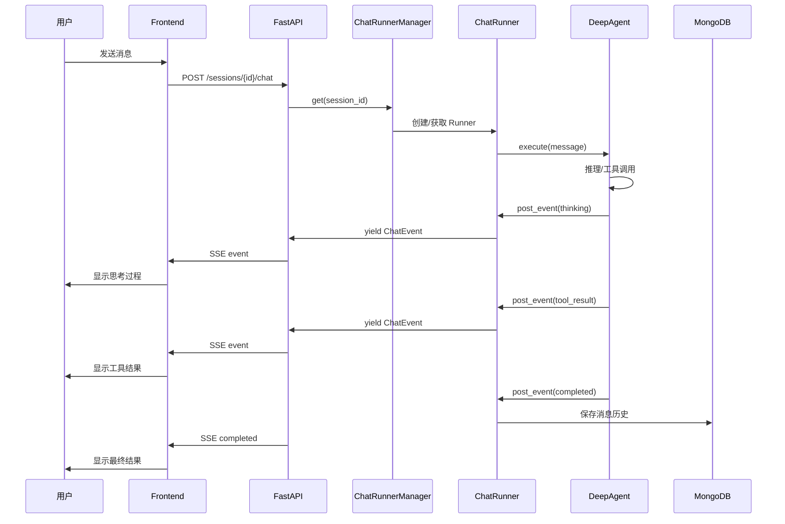

# Chat 模式后端架构

> **版本**: v1.0  
> **日期**: 2026-04-30  
> **状态**: 初稿  
> **关联文档**: [design.md](./design.md) §2.1（双模式架构）, [refactor-plan-v3.md](./refactor-plan.md)

---

## 1. 架构概述

Chat 模式后端采用 **ChatRunner + asyncio.Queue SSE 推送** 架构，独立于 Pipeline 模式的 LangGraph StateGraph。

```
┌─────────────────────────────────────────────────────────────────┐
│                    FastAPI Gateway (Port 8000)                   │
│  ┌────────────────────────┐    ┌─────────────────────────────┐ │
│  │    Chat 模式路由        │    │      Pipeline 模式路由       │ │
│  │  /api/v1/sessions/*    │    │   /api/v1/cases/*           │ │
│  │  /api/v1/chat          │    │   /api/v1/reviews/*         │ │
│  │  /api/v1/models        │    │   /api/v1/artifacts/*       │ │
│  │  /api/v1/statistics    │    │   /api/v1/pipeline/*        │ │
│  └────────────────────────┘    └─────────────────────────────┘ │
└─────────────────────────────────────────────────────────────────┘
            │                              │
            ▼                              ▼
┌─────────────────────┐          ┌─────────────────────┐
│   Chat 引擎          │          │  LangGraph Pipeline  │
│   (DeepAgent)        │          │  (StateGraph)        │
│   · Session管理      │          │  · Explore Node      │
│   · SSE 推送         │          │  · Plan Node         │
│   · Tool执行         │          │  · Develop Node      │
│   · Skill加载        │          │  · Review Node       │
│                      │          │  · Test Node         │
│                      │          │  · Human Gate        │
└─────────────────────┘          └─────────────────────┘
```

---

## 2. 核心组件

### 2.1 ChatRunner

ChatRunner 是 Chat 模式的核心执行器，负责管理单个会话的 Agent 执行流程。

```python
# backend/chat/runner.py
class ChatRunner:
    """Chat 会话执行器 — 管理单会话的 DeepAgent 生命周期"""

    def __init__(
        self,
        session_id: str,
        model_config: ModelConfig,
        sandbox_client: SandboxClient,
    ):
        self.session_id = session_id
        self.model_config = model_config
        self.sandbox_client = sandbox_client
        self._event_queue: asyncio.Queue[ChatEvent] = asyncio.Queue()
        self._agent: DeepAgent | None = None
        self._running = False

    async def run(
        self,
        user_message: str,
        attachments: list[Attachment] | None = None,
    ) -> AsyncIterator[ChatEvent]:
        """执行用户消息，流式返回事件"""
        self._running = True

        # 初始化 Agent
        self._agent = DeepAgent(
            model=self.model_config,
            sandbox=self.sandbox_client,
            session_id=self.session_id,
        )

        # 启动执行
        task = asyncio.create_task(
            self._agent.execute(user_message, attachments)
        )

        # 流式返回事件
        while self._running:
            try:
                event = await asyncio.wait_for(
                    self._event_queue.get(),
                    timeout=1.0,
                )
                yield event
                if event.event_type == "completed":
                    break
            except asyncio.TimeoutError:
                if task.done():
                    break

        self._running = False

    async def stop(self):
        """停止当前执行"""
        self._running = False
        if self._agent:
            await self._agent.stop()

    async def post_event(self, event: ChatEvent):
        """Agent 内部调用，将事件放入队列"""
        await self._event_queue.put(event)
```

### 2.2 SSE 事件流

Chat SSE 使用独立的 Redis channel，与 Pipeline SSE 隔离。

```python
# backend/chat/sse.py
class ChatEventPublisher:
    """Chat SSE 事件发布器 — 使用独立 Redis channel"""

    def __init__(self, redis: aioredis.Redis):
        self.redis = redis

    def _channel(self, session_id: str) -> str:
        return f"chat:{session_id}:events"

    async def publish(self, session_id: str, event: ChatEvent):
        await self.redis.publish(
            self._channel(session_id),
            event.model_dump_json(),
        )

# SSE Endpoint
@router.post("/sessions/{session_id}/chat")
async def chat_stream(
    session_id: str,
    request: ChatRequest,
    user: User = Depends(get_current_user),
) -> EventSourceResponse:
    """Chat SSE 流式响应"""
    runner = ChatRunnerManager.get(session_id)

    async def event_generator():
        async for event in runner.run(request.message, request.attachments):
            yield {
                "id": event.id,
                "event": event.event_type,
                "data": event.model_dump_json(),
            }

    return EventSourceResponse(event_generator())
```

### 2.3 Session 状态管理

```python
# backend/chat/session.py
class SessionState:
    """会话状态 — 存储在 MongoDB"""

    id: str
    user_id: str
    title: str
    messages: list[ChatMessage]
    status: Literal["active", "archived", "deleted"]
    pinned: bool
    created_at: datetime
    updated_at: datetime
    model_config: ModelConfig

class SessionManager:
    """会话管理器"""

    async def create(
        self,
        user_id: str,
        title: str,
        model_config: ModelConfig,
    ) -> SessionState:
        ...

    async def get(self, session_id: str) -> SessionState | None:
        ...

    async def update_title(self, session_id: str, title: str) -> None:
        ...

    async def delete(self, session_id: str) -> None:
        ...

    async def list_by_user(
        self,
        user_id: str,
        status: str | None = None,
    ) -> list[SessionState]:
        ...
```

### 2.4 ChatRunnerManager

```python
# backend/chat/manager.py
class ChatRunnerManager:
    """ChatRunner 实例管理器 — 进程内单例"""

    _instances: dict[str, ChatRunner] = {}
    _lock = asyncio.Lock()

    @classmethod
    async def get(cls, session_id: str) -> ChatRunner:
        async with cls._lock:
            if session_id not in cls._instances:
                runner = ChatRunner(session_id, ...)
                cls._instances[session_id] = runner
            return cls._instances[session_id]

    @classmethod
    async def remove(cls, session_id: str):
        async with cls._lock:
            if session_id in cls._instances:
                runner = cls._instances.pop(session_id)
                await runner.stop()
```

---

## 3. 与 Pipeline 模式的资源隔离

| 资源 | Chat 模式 | Pipeline 模式 | 隔离方式 |
|------|-----------|---------------|----------|
| Redis Channel | `chat:{session_id}:events` | `case:{case_id}:events` | 命名空间隔离 |
| MongoDB 集合 | `sessions`, `messages` | `contribution_cases`, `human_reviews` | 集合隔离 |
| PostgreSQL | 不使用 | `checkpoints`, `checkpoint_blobs` | — |
| Agent 实例 | DeepAgent | LangGraph StateGraph | 独立运行时 |
| SSE Endpoint | `POST /sessions/:id/chat` | `GET /cases/:id/events` | 独立端点 |

---

## 4. Session 状态管理流程



---

## 5. 数据模型

### 5.1 ChatEvent

```python
class ChatEvent(BaseModel):
    """Chat SSE 事件"""
    id: str = Field(default_factory=lambda: str(uuid4()))
    event_type: Literal[
        "thinking",      # Agent 思考过程
        "tool_call",     # 工具调用请求
        "tool_result",   # 工具调用结果
        "output",        # 最终输出
        "error",         # 错误
        "completed",     # 完成
    ]
    data: dict[str, Any]
    timestamp: datetime = Field(default_factory=datetime.utcnow)
```

### 5.2 ChatMessage

```python
class ChatMessage(BaseModel):
    """聊天消息"""
    id: str
    role: Literal["user", "assistant", "system"]
    content: str
    attachments: list[Attachment] | None = None
    tool_calls: list[ToolCall] | None = None
    created_at: datetime
```

---

## 6. 与现有 ScienceClaw 代码的兼容

ScienceClaw 现有 Chat 后端代码位于 `backend/route/sessions.py` 和 `backend/deepagent/` 目录下。迁移策略：

1. **保留现有路由**: `/api/v1/sessions/*` 和 `/api/v1/chat` 保持不动
2. **适配为 FastAPI 路由**: 如果现有代码不是 FastAPI 路由，需要适配
3. **通过 bridge 复用 DeepAgent**: 创建 `backend/chat/deepagents_bridge.py` 包裹现有 DeepAgent 逻辑
4. **不直接暴露内部实现**: DeepAgent 内部逻辑不暴露给新路由

```
backend/
  chat/
    __init__.py
    runner.py          # 新增：ChatRunner
    sse.py             # 新增：ChatEventPublisher
    session.py         # 新增：SessionManager
    manager.py         # 新增：ChatRunnerManager
    deepagents_bridge.py # 新增：适配层
  deepagent/           # 保留：ScienceClaw 现有代码
```

---

> **本文档自 2026-04-30 起生效。Chat 后端实现必须遵循本架构。**
